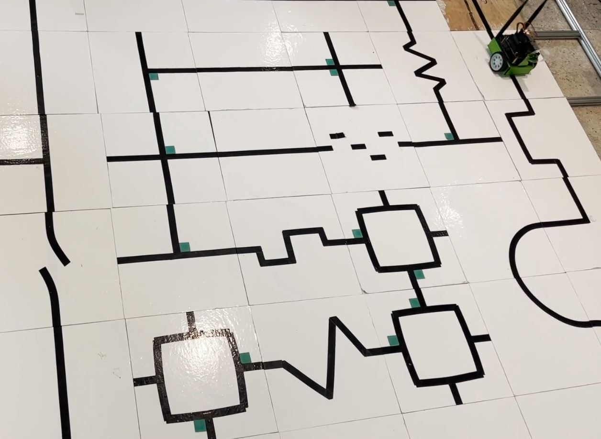

#  Autonomous Path Following
Inspired by the RoboCupJunior Rescue Line competition, this project involves creating an autonomous jetbot that navigates a dynamic field made up of modular tiles with different patterns. The unpredictable layout of these tiles introduces complexity to the robot's pathfinding, simulating real-world challenges with a white floor and different color patches with specified meaning such as turning. The project emphasizes the importance of adaptability to environmental factors such as lighting and new obstacles. The main goals are to develop a robot that can follow a black line on a white floor through a field with distinct patterns, efficiently navigating intersections marked with green squares and adapting its path as needed. The robot must also recognize and respond to stop signs (red patch) and varied environmental conditions. By incorporating computer vision techniques, including image processing and contour analysis with OpenCV, the project achieves real-time decision-making and demonstrate a thorough understanding of autonomous robotic systems in accordance with previous competition's rules and requirements. <b>  The description of the project with design detail and  video demo can be found [here](https://kirubelsol.github.io/pages/LineFollowing.html) . </b>

    &nbsp;&nbsp;&nbsp;&nbsp;

 Demo Setup 

## Contributors
-   Kirubel Solomon 
-   Lukelo Luoga
-   Aya Al Mir