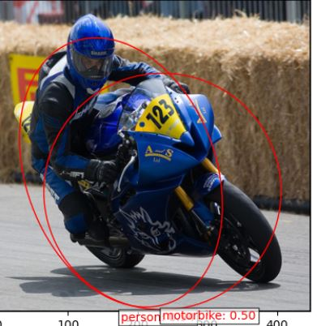
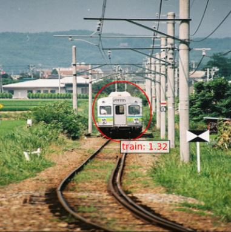
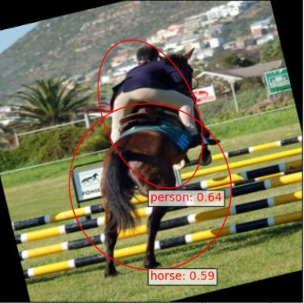
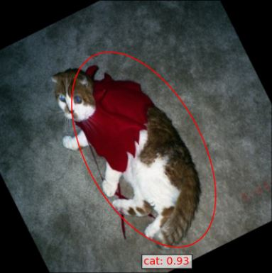

# Detecting Objects using Elliptical Anchor Boxes
This project involves building a real-time object detection model using elliptical anchor boxes instead of traditional rectangular ones. In the field of computer vision, common object detection models such as YOLO use rectangular anchor boxes, which often result in lower detection accuracy for non-rectangular shapes like elongated objects. By replacing rectangular anchor boxes with elliptical ones, this project aims to enhance precision and detection accuracy for rotated and elongated objects in images. Creating the EllipseNet model involves several crucial steps. These include understanding the architecture of models like YOLO in depth, modifying these architectures, augmenting data for training, and developing a mathematical framework for elliptical boxes. Additionally, a unique method for calculating the intersection over union (IOU) and additional helper functions to calculate average precision, train the model, and more have been implemented. The detailed explanation and implmentation can be found in the notebook while a general description with major parts can be found at [here](https://kirubelsol.github.io/pages/EllipseNet.html)

    

        
        Detecting Person and Motorbike: No Rotation
    

     

        
         P-tile thresholded image
    

    

        
        Detecting Person and Horse: Rotated
    

    

        
         Detecting Cat: Rotated 
    

