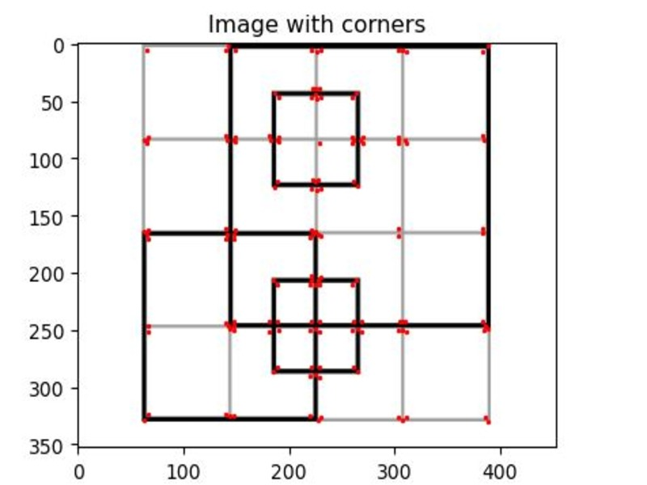

# Harris Corner Detector Implementation
Harris corner detection is a simple and efficient algorithm used for detecting corners in computer vision applications. The essential steps in finding the corners involve finding the intesnity gradient of the image in both horizontal and vertical direction. Afterwards, a matrix to capture gradient information to analyze change in intensity is created, followed by implementation of corner response function to calculate the likelihood of a pixel being a corner. Finally, non-maxima suppression to identify the local maxima in the corner response function is done. The implementation can be found in the notebook and general description an be found [here](https://kirubelsol.github.io/pages/harriscorner.html). 

      
    Corner Detection

