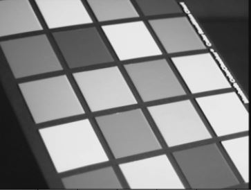
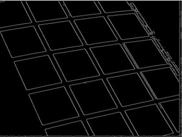
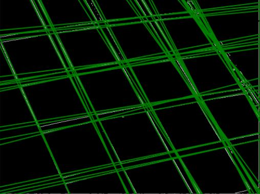
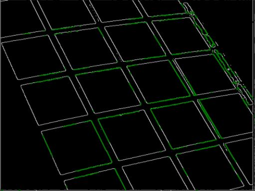

# Hough Transform Implementation
The notebook includes an implementation of hough transform which is a feature extraction technique used in computer vision to detect simple shapes such as lines and circles in images, in this case line segments. The details are included in the notebook and description can also be found [here](https://kirubelsol.github.io/pages/houghtransform.html).

    

        
        Original Image
    

    

        
         P-tile thresholded image
    

    

        
        Extended Hough Lines
    

    

        
         Line Segments 
    

